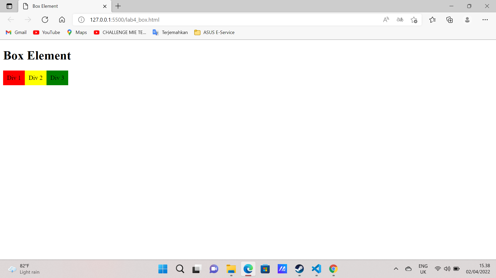
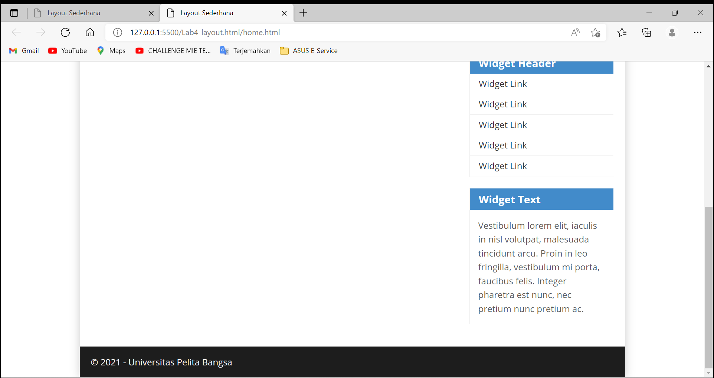
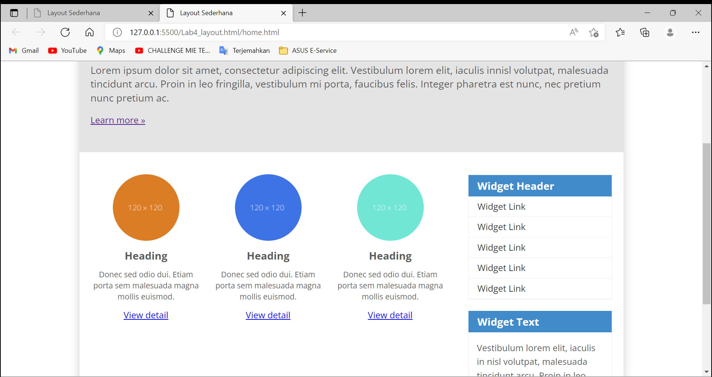
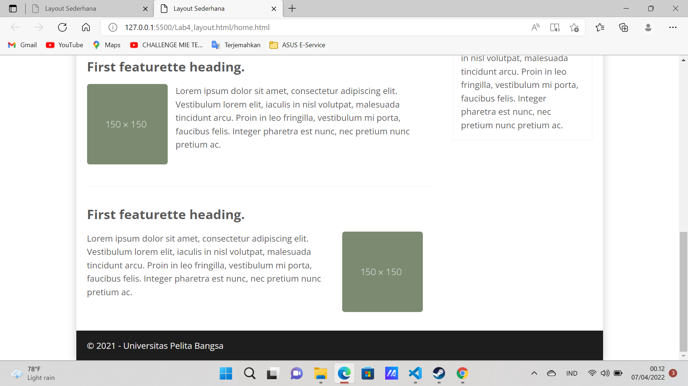

| AHMAD ALFIAN CHANDRA      | 312010336             |
| ----------------------    | -----------------     |
| TI.20.A2                  | PEMROGRAMAN WEB       |
| PRATIKUM 4                | PERTEMUAN 5           |

## PERTEMUAN  5


## Lab4Web

Di pertemuan kali ini mari kita membahas bagaiman membuat **Website Layout** dengan property **float** dan juga membuat ***box element**

## 1). MEMBUAT DOKUMEN HTML DENGAN NAMA lab4_box.html

```html
<!DOCTYPE html>
<html lang="en">
<head>
    <meta charset="UTF-8">
    <meta http-equiv="X-UA-Compatible" content="IE=edge">
    <meta name="viewport" content="width=device-width, initial-scale=1.0">
    <title>Box Element</title>
</head>
<body>
    <header>
        <h1>Box Element</h1>
    </header>
</body>
</html>
```
## 2). MEMBUAT BOX ELEMENT

## CONTOH TAMPILAN NYA


**PENJELASAN**
Menambahkan BOX ELEMENT

## 3). MENGATUR CLEARFIX ELEMENT

## CONTOH TAMPILAN NYA


**PENJELASAN**
Menambahkan CLEARFIX ELEMENT

## 4) MEMBUAT LAYOUT SEDERHANA

## CONTOH TAMPILAN NYA


**PENJELASAN**
Menambahkan Layout sederhana

## 5) MEMBUAT NAVIGASI

## CONTOH TAMPILAN NYA


**PENJELASAN**
Menambahkan Navigasi

## 6) MEMBUAT HERO PANEL

## CONTOH TAMPILAN NYA


**PENJELASAN**
Menambahkan hero Panel

## 7) MEMBUAT LAYOUT MAIN SIDEBAR WIDGET

## CONTOH PENAMPILAN NYA


**PENJELASAN**
Menambahkan Layout Main Sidebar Widget

## 8) MENGATUR FOOTER

## CONTOH TENAMPILAN NYA


**PENJELASAN**
Mengatur footer

## 9) MENAMBAHKAN ELEMEN LAINNYA PADA MAIN CONTENT

## CONTOH TAMPILAN NYA


**PENJELASAN**
MENAMBAHKAN ELEMEN LAINNYA PADA MAIN CONTENT

## 10) MEMBUAT CONTENT ARTIKEL


**PENJELASAN**
MENAMBAHKAN CONTENT ARTIKEL